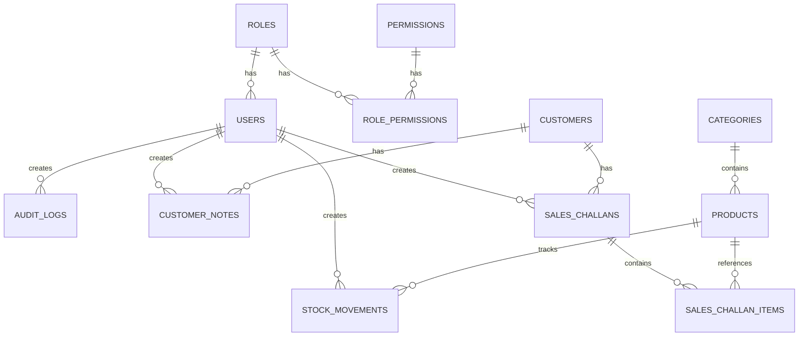

# Mini ERP + CRM Operations Portal — Complete Engineering Plan

## Business Context

A wholesale/distribution company needs an internal operational portal used by **Sales**, **Warehouse**, **Accounts**, and **Admin** teams. The system manages customers, products, inventory, stock movements, sales challans, and CRM follow-ups. This plan treats the project as a production SaaS product—not a toy demo.

---

## 1. Complete Architecture

### 1.1 High-Level Architecture Diagram

```
┌──────────────────────────────────────────────────────────────────────┐
│                         MONOREPO (pnpm workspaces)                   │
│                                                                      │
│  ┌─────────────────────┐   ┌───────────────────────┐                │
│  │   packages/client    │   │   packages/server      │               │
│  │   (React + Vite)     │   │   (Express + Prisma)   │               │
│  │                      │   │                         │               │
│  │  React Router        │   │  REST API Controllers   │               │
│  │  TanStack Query      │   │  Service Layer          │               │
│  │  Shadcn UI + TW      │   │  Prisma ORM             │               │
│  │  Zustand (state)     │   │  JWT Auth Middleware     │               │
│  │  Recharts (charts)   │   │  Zod Validation         │               │
│  └──────────┬───────────┘   └───────────┬─────────────┘               │
│             │                           │                             │
│  ┌──────────┴───────────────────────────┴─────────────┐              │
│  │              packages/shared                        │              │
│  │   Types · Validators · Constants · Enums            │              │
│  └─────────────────────────────────────────────────────┘              │
│                                                                      │
│  ┌───────────────────────────────────────────────────────┐           │
│  │              Configuration Layer                       │           │
│  │   .env files · tsconfig paths · ESLint · Prettier      │           │
│  └───────────────────────────────────────────────────────┘           │
└──────────────────────────────────────────────────────────────────────┘
                          │                    │
                          ▼                    ▼
                   ┌──────────┐         ┌──────────────┐
                   │  Vercel  │         │    Render     │
                   │ (Client) │         │   (Server)    │
                   └──────────┘         └──────┬───────┘
                                               │
                                        ┌──────▼───────┐
                                        │   Neon DB     │
                                        │ (PostgreSQL)  │
                                        └──────────────┘
```

### 1.2 Monorepo Structure

- **`packages/client`** — React SPA (Vite, TypeScript)
- **`packages/server`** — Express API server (TypeScript, Prisma)
- **`packages/shared`** — Shared TypeScript types, Zod schemas, enums, constants
- Root-level config: `pnpm-workspace.yaml`, `tsconfig.base.json`, `.eslintrc`, `.prettierrc`

### 1.3 Frontend Architecture (packages/client)

```
Feature-based structure with co-located components:

src/
├── app/                    # App-level setup (providers, router, layout)
├── features/               # Feature modules (auth, customers, products, challans, dashboard)
│   └── <feature>/
│       ├── api/            # TanStack Query hooks (queries + mutations)
│       ├── components/     # Feature-specific UI components
│       ├── pages/          # Route-level page components
│       ├── hooks/          # Feature-specific hooks
│       └── utils/          # Feature helpers
├── components/             # Shared/global UI components (Sidebar, Navbar, DataTable, etc.)
├── hooks/                  # Global hooks (useAuth, useDebounce, useCommandPalette)
├── lib/                    # Utilities (api-client, date-helpers, cn)
├── stores/                 # Zustand stores (auth, ui, sidebar)
└── styles/                 # Global CSS, Tailwind config overrides
```

**State Management Strategy:**
| Concern | Solution |
|---|---|
| Server state (API data) | TanStack Query (cache, refetch, optimistic updates) |
| Auth state | Zustand persisted store |
| UI state (sidebar, theme, modals) | Zustand ephemeral store |
| Form state | React Hook Form + Zod resolvers |

### 1.4 Backend Architecture (packages/server)

```
Layered architecture (Controller → Service → Repository):

src/
├── app.ts                  # Express app setup, middleware registration
├── server.ts               # HTTP server entry point
├── config/                 # Environment config, constants
├── middleware/              # Auth, error handler, rate limiter, request logger
├── modules/                # Feature modules
│   └── <module>/
│       ├── controller.ts   # Route handlers (HTTP concerns only)
│       ├── service.ts      # Business logic
│       ├── repository.ts   # Prisma database queries
│       ├── validator.ts    # Zod request schemas
│       └── types.ts        # Module-specific types
├── shared/                 # Shared utilities (pagination, response helpers, error classes)
└── prisma/
    ├── schema.prisma       # Database schema
    ├── migrations/         # Prisma migrations
    └── seed.ts             # Seed data (roles, demo users, sample data)
```

**Key architectural decisions:**
- **Controller** handles HTTP request/response only — no business logic.
- **Service** contains all business logic and orchestrates repositories.
- **Repository** encapsulates Prisma queries — swappable ORM layer.
- All errors flow through a centralized `errorHandler` middleware.
- Request validation happens via Zod middleware before reaching controllers.

### 1.5 Shared Package (packages/shared)

```
src/
├── types/                  # TypeScript interfaces and type aliases
│   ├── auth.ts
│   ├── customer.ts
│   ├── product.ts
│   ├── challan.ts
│   └── common.ts           # Pagination, API Response envelope, etc.
├── validators/             # Zod schemas (shared between client forms and server validation)
│   ├── auth.schema.ts
│   ├── customer.schema.ts
│   ├── product.schema.ts
│   └── challan.schema.ts
├── enums/                  # Role, CustomerType, CustomerStatus, MovementType, ChallanStatus
├── constants/              # Permissions map, pagination defaults, regex patterns
└── index.ts                # Barrel export
```

### 1.6 Configuration Strategy

| Config | Location | Purpose |
|---|---|---|
| `pnpm-workspace.yaml` | Root | Define monorepo packages |
| `tsconfig.base.json` | Root | Shared TS compiler options |
| `tsconfig.json` per package | Each package | Extends base, adds path aliases |
| `.env` / `.env.example` | `packages/server` | DB URL, JWT secret, PORT, CORS origin |
| `.env` / `.env.example` | `packages/client` | `VITE_API_URL` |
| `.eslintrc.cjs` | Root | Shared lint rules |
| `.prettierrc` | Root | Code formatting |
| `Dockerfile` (bonus) | Root | Multi-stage build |

---

## 2. Technology Decisions

### Frontend

| Technology | Why |
|---|---|
| **React 18** | Industry standard for SPAs; massive ecosystem; required by the case study |
| **TypeScript** | Type safety across the monorepo; shared types between client & server; catches bugs at compile time |
| **Vite** | Sub-second HMR, native ESM, 10x faster than CRA; excellent DX |
| **React Router v7** | File-based routing mental model; nested layouts; route-level code splitting |
| **TanStack Query v5** | Eliminates hand-rolled API state; automatic caching, deduplication, refetching, optimistic updates, pagination |
| **Tailwind CSS v3** | Utility-first CSS; matches the design aesthetic (glassmorphism, spacing, responsive); eliminates dead CSS |
| **Shadcn UI** | Not a component library — a copy-paste system. Full control over every component. Built on Radix primitives (accessible). No version lock-in |
| **Zustand** | Lightweight (< 1kB), no boilerplate, TypeScript-first, persist middleware for auth |
| **React Hook Form** | Performant forms (uncontrolled inputs), Zod integration, minimal re-renders |
| **Recharts** | Composable chart library built on D3; simple API; responsive |
| **cmdk** | Command palette (Ctrl+K) component — used by Linear, Vercel, Raycast |

### Backend

| Technology | Why |
|---|---|
| **Node.js 20 LTS** | Non-blocking I/O ideal for REST APIs; shared language with frontend; required by case study |
| **Express.js** | Minimal, battle-tested, huge middleware ecosystem; gives full control over architecture |
| **TypeScript** | End-to-end type safety; shared schemas with client |
| **Prisma** | Type-safe ORM; auto-generated client from schema; excellent migrations; works perfectly with Neon Postgres |
| **PostgreSQL** | ACID-compliant; JSON support for snapshots; excellent for ERP data (transactions, joins, constraints) |
| **JWT (jsonwebtoken)** | Stateless auth; role embedded in token; industry standard for REST APIs |
| **Bcrypt** | Industry-standard password hashing; adaptive cost factor |
| **Zod** | Schema validation shared with frontend; runtime type checking; excellent error messages |
| **helmet** | Security headers middleware |
| **cors** | Configurable CORS for API |
| **morgan + winston** | Request logging + structured application logging |

### Deployment

| Platform | Why |
|---|---|
| **Vercel** | Zero-config for Vite/React; edge network; preview deployments; free tier |
| **Render** | Free web service tier; auto-deploy from GitHub; supports Node.js; health checks |
| **Neon** | Serverless Postgres; free tier with 0.5 GB; branching for staging; connection pooling built-in |

---

## 3. Database Design

### 3.1 Entity Relationship Diagram



### 3.2 Complete Schema

#### Users

```sql
CREATE TABLE users (
    id              UUID PRIMARY KEY DEFAULT gen_random_uuid(),
    email           VARCHAR(255) NOT NULL UNIQUE,
    password_hash   VARCHAR(255) NOT NULL,
    full_name       VARCHAR(150) NOT NULL,
    phone           VARCHAR(20),
    avatar_url      VARCHAR(500),
    role_id         UUID NOT NULL REFERENCES roles(id),
    is_active       BOOLEAN NOT NULL DEFAULT true,
    last_login_at   TIMESTAMPTZ,
    created_at      TIMESTAMPTZ NOT NULL DEFAULT NOW(),
    updated_at      TIMESTAMPTZ NOT NULL DEFAULT NOW(),
    deleted_at      TIMESTAMPTZ  -- Soft delete
);

CREATE INDEX idx_users_email ON users(email) WHERE deleted_at IS NULL;
CREATE INDEX idx_users_role_id ON users(role_id);
```

#### Roles

```sql
CREATE TABLE roles (
    id          UUID PRIMARY KEY DEFAULT gen_random_uuid(),
    name        VARCHAR(50) NOT NULL UNIQUE,   -- 'admin', 'sales', 'warehouse', 'accounts'
    display_name VARCHAR(100) NOT NULL,
    description TEXT,
    created_at  TIMESTAMPTZ NOT NULL DEFAULT NOW(),
    updated_at  TIMESTAMPTZ NOT NULL DEFAULT NOW()
);
```

#### Permissions

```sql
CREATE TABLE permissions (
    id          UUID PRIMARY KEY DEFAULT gen_random_uuid(),
    resource    VARCHAR(100) NOT NULL,   -- 'customers', 'products', 'challans', 'inventory', 'users'
    action      VARCHAR(50) NOT NULL,    -- 'create', 'read', 'update', 'delete', 'export'
    description TEXT,
    UNIQUE(resource, action)
);

CREATE TABLE role_permissions (
    id            UUID PRIMARY KEY DEFAULT gen_random_uuid(),
    role_id       UUID NOT NULL REFERENCES roles(id) ON DELETE CASCADE,
    permission_id UUID NOT NULL REFERENCES permissions(id) ON DELETE CASCADE,
    UNIQUE(role_id, permission_id)
);

CREATE INDEX idx_role_permissions_role ON role_permissions(role_id);
```

#### Customers

```sql
CREATE TABLE customers (
    id              UUID PRIMARY KEY DEFAULT gen_random_uuid(),
    customer_name   VARCHAR(200) NOT NULL,
    mobile          VARCHAR(20) NOT NULL,
    email           VARCHAR(255),
    business_name   VARCHAR(200),
    gst_number      VARCHAR(15),            -- Optional, Indian GST format
    customer_type   VARCHAR(20) NOT NULL     -- ENUM: 'retail', 'wholesale', 'distributor'
                    CHECK (customer_type IN ('retail', 'wholesale', 'distributor')),
    address         TEXT,
    city            VARCHAR(100),
    state           VARCHAR(100),
    pincode         VARCHAR(10),
    status          VARCHAR(20) NOT NULL DEFAULT 'lead'
                    CHECK (status IN ('lead', 'active', 'inactive')),
    follow_up_date  DATE,
    created_by      UUID REFERENCES users(id),
    created_at      TIMESTAMPTZ NOT NULL DEFAULT NOW(),
    updated_at      TIMESTAMPTZ NOT NULL DEFAULT NOW(),
    deleted_at      TIMESTAMPTZ  -- Soft delete
);

CREATE INDEX idx_customers_status ON customers(status) WHERE deleted_at IS NULL;
CREATE INDEX idx_customers_type ON customers(customer_type) WHERE deleted_at IS NULL;
CREATE INDEX idx_customers_follow_up ON customers(follow_up_date) WHERE deleted_at IS NULL AND follow_up_date IS NOT NULL;
CREATE INDEX idx_customers_search ON customers USING gin(to_tsvector('english', customer_name || ' ' || COALESCE(business_name, '') || ' ' || mobile));
```

#### Customer Notes

```sql
CREATE TABLE customer_notes (
    id            UUID PRIMARY KEY DEFAULT gen_random_uuid(),
    customer_id   UUID NOT NULL REFERENCES customers(id) ON DELETE CASCADE,
    note          TEXT NOT NULL,
    note_type     VARCHAR(20) NOT NULL DEFAULT 'general'
                  CHECK (note_type IN ('general', 'follow_up', 'complaint', 'order')),
    created_by    UUID NOT NULL REFERENCES users(id),
    created_at    TIMESTAMPTZ NOT NULL DEFAULT NOW(),
    updated_at    TIMESTAMPTZ NOT NULL DEFAULT NOW(),
    deleted_at    TIMESTAMPTZ
);

CREATE INDEX idx_customer_notes_customer ON customer_notes(customer_id) WHERE deleted_at IS NULL;
CREATE INDEX idx_customer_notes_created ON customer_notes(created_at DESC);
```

#### Categories

```sql
CREATE TABLE categories (
    id          UUID PRIMARY KEY DEFAULT gen_random_uuid(),
    name        VARCHAR(100) NOT NULL UNIQUE,
    description TEXT,
    created_at  TIMESTAMPTZ NOT NULL DEFAULT NOW(),
    updated_at  TIMESTAMPTZ NOT NULL DEFAULT NOW(),
    deleted_at  TIMESTAMPTZ
);
```

#### Products

```sql
CREATE TABLE products (
    id                  UUID PRIMARY KEY DEFAULT gen_random_uuid(),
    product_name        VARCHAR(200) NOT NULL,
    sku                 VARCHAR(50) NOT NULL UNIQUE,
    category_id         UUID REFERENCES categories(id),
    unit_price          DECIMAL(12, 2) NOT NULL CHECK (unit_price >= 0),
    current_stock       INTEGER NOT NULL DEFAULT 0 CHECK (current_stock >= 0),
    min_stock_alert     INTEGER NOT NULL DEFAULT 0 CHECK (min_stock_alert >= 0),
    unit                VARCHAR(20) NOT NULL DEFAULT 'pcs'
                        CHECK (unit IN ('pcs', 'kg', 'ltr', 'box', 'pack', 'dozen')),
    location            VARCHAR(100),       -- Warehouse/location identifier
    description         TEXT,
    image_url           VARCHAR(500),
    is_active           BOOLEAN NOT NULL DEFAULT true,
    created_at          TIMESTAMPTZ NOT NULL DEFAULT NOW(),
    updated_at          TIMESTAMPTZ NOT NULL DEFAULT NOW(),
    deleted_at          TIMESTAMPTZ
);

CREATE INDEX idx_products_sku ON products(sku) WHERE deleted_at IS NULL;
CREATE INDEX idx_products_category ON products(category_id) WHERE deleted_at IS NULL;
CREATE INDEX idx_products_low_stock ON products(current_stock) WHERE deleted_at IS NULL AND is_active = true;
CREATE INDEX idx_products_search ON products USING gin(to_tsvector('english', product_name || ' ' || sku));
```

#### Stock Movements

```sql
CREATE TABLE stock_movements (
    id              UUID PRIMARY KEY DEFAULT gen_random_uuid(),
    product_id      UUID NOT NULL REFERENCES products(id),
    quantity         INTEGER NOT NULL CHECK (quantity > 0),
    movement_type   VARCHAR(5) NOT NULL CHECK (movement_type IN ('IN', 'OUT')),
    reason          TEXT NOT NULL,
    reference_type  VARCHAR(20),            -- 'challan', 'manual', 'adjustment', 'return'
    reference_id    UUID,                   -- Links to challan ID or other source
    previous_stock  INTEGER NOT NULL,       -- Stock before this movement
    new_stock       INTEGER NOT NULL,       -- Stock after this movement
    created_by      UUID NOT NULL REFERENCES users(id),
    created_at      TIMESTAMPTZ NOT NULL DEFAULT NOW()
    -- No updated_at / deleted_at: stock movements are immutable audit records
);

CREATE INDEX idx_stock_movements_product ON stock_movements(product_id);
CREATE INDEX idx_stock_movements_created ON stock_movements(created_at DESC);
CREATE INDEX idx_stock_movements_type ON stock_movements(movement_type);
CREATE INDEX idx_stock_movements_reference ON stock_movements(reference_type, reference_id);
```

#### Sales Challans

```sql
CREATE TABLE sales_challans (
    id              UUID PRIMARY KEY DEFAULT gen_random_uuid(),
    challan_number  VARCHAR(20) NOT NULL UNIQUE,    -- Auto: 'SC-YYYYMM-0001'
    customer_id     UUID NOT NULL REFERENCES customers(id),
    status          VARCHAR(20) NOT NULL DEFAULT 'draft'
                    CHECK (status IN ('draft', 'confirmed', 'cancelled')),
    total_quantity  INTEGER NOT NULL DEFAULT 0,
    total_amount    DECIMAL(14, 2) NOT NULL DEFAULT 0,
    notes           TEXT,
    confirmed_at    TIMESTAMPTZ,
    cancelled_at    TIMESTAMPTZ,
    cancellation_reason TEXT,
    created_by      UUID NOT NULL REFERENCES users(id),
    created_at      TIMESTAMPTZ NOT NULL DEFAULT NOW(),
    updated_at      TIMESTAMPTZ NOT NULL DEFAULT NOW(),
    deleted_at      TIMESTAMPTZ
);

CREATE INDEX idx_challans_number ON sales_challans(challan_number);
CREATE INDEX idx_challans_customer ON sales_challans(customer_id) WHERE deleted_at IS NULL;
CREATE INDEX idx_challans_status ON sales_challans(status) WHERE deleted_at IS NULL;
CREATE INDEX idx_challans_created ON sales_challans(created_at DESC);
```

#### Sales Challan Items (Product Snapshots)

```sql
CREATE TABLE sales_challan_items (
    id              UUID PRIMARY KEY DEFAULT gen_random_uuid(),
    challan_id      UUID NOT NULL REFERENCES sales_challans(id) ON DELETE CASCADE,
    product_id      UUID NOT NULL REFERENCES products(id),
    -- Snapshot fields (frozen at time of challan creation)
    product_name    VARCHAR(200) NOT NULL,
    sku             VARCHAR(50) NOT NULL,
    unit_price      DECIMAL(12, 2) NOT NULL,
    -- Order-specific fields
    quantity        INTEGER NOT NULL CHECK (quantity > 0),
    line_total      DECIMAL(14, 2) NOT NULL,    -- unit_price * quantity
    created_at      TIMESTAMPTZ NOT NULL DEFAULT NOW()
);

CREATE INDEX idx_challan_items_challan ON sales_challan_items(challan_id);
CREATE INDEX idx_challan_items_product ON sales_challan_items(product_id);
```

#### Audit Logs

```sql
CREATE TABLE audit_logs (
    id              UUID PRIMARY KEY DEFAULT gen_random_uuid(),
    user_id         UUID REFERENCES users(id),
    action          VARCHAR(50) NOT NULL,    -- 'CREATE', 'UPDATE', 'DELETE', 'LOGIN', 'LOGOUT'
    resource        VARCHAR(50) NOT NULL,    -- 'customer', 'product', 'challan', 'stock', 'user'
    resource_id     UUID,
    old_values      JSONB,                   -- Previous state
    new_values      JSONB,                   -- New state
    ip_address      VARCHAR(45),
    user_agent      TEXT,
    created_at      TIMESTAMPTZ NOT NULL DEFAULT NOW()
    -- Audit logs are NEVER updated or deleted
);

CREATE INDEX idx_audit_logs_user ON audit_logs(user_id);
CREATE INDEX idx_audit_logs_resource ON audit_logs(resource, resource_id);
CREATE INDEX idx_audit_logs_created ON audit_logs(created_at DESC);
CREATE INDEX idx_audit_logs_action ON audit_logs(action);
```

### 3.3 Soft Delete Strategy

All business entities (`users`, `customers`, `customer_notes`, `categories`, `products`, `sales_challans`) use a `deleted_at TIMESTAMPTZ` column:

- `NULL` → active record
- Timestamp → soft-deleted
- All queries add `WHERE deleted_at IS NULL` (enforced via Prisma middleware)
- Partial indexes exclude soft-deleted rows for performance
- **Stock movements and audit logs are NEVER deleted** — they are immutable audit trails

### 3.4 Sequence: Challan Number Generation

```sql
-- Challan numbers follow format: SC-YYYYMM-XXXX
-- Example: SC-202607-0001, SC-202607-0002
-- Implemented via a sequence table + transaction lock:

CREATE TABLE sequences (
    id          VARCHAR(50) PRIMARY KEY,
    prefix      VARCHAR(20) NOT NULL,
    current_val INTEGER NOT NULL DEFAULT 0,
    updated_at  TIMESTAMPTZ NOT NULL DEFAULT NOW()
);
```

This is implemented in the service layer using a database transaction with `SELECT ... FOR UPDATE` to prevent race conditions.

---

## 4. API Design

### 4.1 API Conventions

- Base URL: `/api/v1`
- Response envelope: `{ success: boolean, data: T | null, error: { code: string, message: string, details?: any } | null, meta?: { page, limit, total, totalPages } }`
- Auth: `Authorization: Bearer <jwt>`
- Content-Type: `application/json`
- Pagination: `?page=1&limit=20`
- Search: `?search=term`
- Sort: `?sortBy=created_at&sortOrder=desc`

### 4.2 Auth Module

| Method | Endpoint | Description | Auth | Roles |
|--------|----------|-------------|------|-------|
| `POST` | `/api/v1/auth/login` | Login with email + password | Public | — |
| `POST` | `/api/v1/auth/logout` | Logout (audit log) | Required | All |
| `GET` | `/api/v1/auth/me` | Get current user profile | Required | All |
| `PUT` | `/api/v1/auth/me` | Update own profile | Required | All |
| `PUT` | `/api/v1/auth/change-password` | Change own password | Required | All |

**POST `/api/v1/auth/login`**
```json
// Request
{ "email": "admin@erp.com", "password": "SecurePass123!" }

// Response 200
{
  "success": true,
  "data": {
    "token": "eyJhbG...",
    "user": { "id": "uuid", "email": "admin@erp.com", "fullName": "Admin User", "role": "admin" }
  }
}

// Response 401
{ "success": false, "error": { "code": "INVALID_CREDENTIALS", "message": "Invalid email or password" } }
```

### 4.3 Users Module (Admin only)

| Method | Endpoint | Description | Auth | Roles |
|--------|----------|-------------|------|-------|
| `GET` | `/api/v1/users` | List all users (paginated) | Required | Admin |
| `GET` | `/api/v1/users/:id` | Get user by ID | Required | Admin |
| `POST` | `/api/v1/users` | Create user | Required | Admin |
| `PUT` | `/api/v1/users/:id` | Update user | Required | Admin |
| `DELETE` | `/api/v1/users/:id` | Soft-delete user | Required | Admin |

### 4.4 Customers Module

| Method | Endpoint | Description | Auth | Roles |
|--------|----------|-------------|------|-------|
| `GET` | `/api/v1/customers` | List customers (paginated, searchable) | Required | Admin, Sales |
| `GET` | `/api/v1/customers/:id` | Get customer details | Required | Admin, Sales |
| `POST` | `/api/v1/customers` | Create customer | Required | Admin, Sales |
| `PUT` | `/api/v1/customers/:id` | Update customer | Required | Admin, Sales |
| `DELETE` | `/api/v1/customers/:id` | Soft-delete customer | Required | Admin |
| `GET` | `/api/v1/customers/:id/notes` | Get customer notes | Required | Admin, Sales |
| `POST` | `/api/v1/customers/:id/notes` | Add customer note | Required | Admin, Sales |
| `PUT` | `/api/v1/customers/:id/notes/:noteId` | Update note | Required | Admin, Sales |
| `DELETE` | `/api/v1/customers/:id/notes/:noteId` | Delete note | Required | Admin |
| `GET` | `/api/v1/customers/follow-ups` | Get upcoming follow-ups | Required | Admin, Sales |

**Query params for `GET /customers`:**
- `?search=` — searches name, business_name, mobile
- `?status=lead|active|inactive`
- `?type=retail|wholesale|distributor`
- `?page=1&limit=20`
- `?sortBy=customer_name|created_at&sortOrder=asc|desc`

**Validation (Create Customer):**
```
customer_name: required, string, 2-200 chars
mobile: required, string, valid phone format
email: optional, valid email format
business_name: optional, string, max 200
gst_number: optional, string, valid GST format (15-char alphanumeric)
customer_type: required, enum ['retail', 'wholesale', 'distributor']
address: optional, text
status: optional, enum ['lead', 'active', 'inactive'], default 'lead'
follow_up_date: optional, ISO date, must be today or future
```

### 4.5 Categories Module

| Method | Endpoint | Description | Auth | Roles |
|--------|----------|-------------|------|-------|
| `GET` | `/api/v1/categories` | List all categories | Required | All |
| `POST` | `/api/v1/categories` | Create category | Required | Admin, Warehouse |
| `PUT` | `/api/v1/categories/:id` | Update category | Required | Admin, Warehouse |
| `DELETE` | `/api/v1/categories/:id` | Soft-delete category | Required | Admin |

### 4.6 Products Module

| Method | Endpoint | Description | Auth | Roles |
|--------|----------|-------------|------|-------|
| `GET` | `/api/v1/products` | List products (paginated, filterable) | Required | All |
| `GET` | `/api/v1/products/:id` | Get product detail | Required | All |
| `POST` | `/api/v1/products` | Create product | Required | Admin, Warehouse |
| `PUT` | `/api/v1/products/:id` | Update product | Required | Admin, Warehouse |
| `DELETE` | `/api/v1/products/:id` | Soft-delete product | Required | Admin |
| `GET` | `/api/v1/products/low-stock` | Get products below min stock | Required | Admin, Warehouse |

**Query params for `GET /products`:**
- `?search=` — searches product_name, sku
- `?category=<category_id>`
- `?lowStock=true` — filter current_stock <= min_stock_alert
- `?isActive=true|false`
- `?page=1&limit=20`
- `?sortBy=product_name|unit_price|current_stock|created_at&sortOrder=asc|desc`

### 4.7 Inventory / Stock Movements Module

| Method | Endpoint | Description | Auth | Roles |
|--------|----------|-------------|------|-------|
| `GET` | `/api/v1/inventory/movements` | List all stock movements (paginated) | Required | Admin, Warehouse |
| `GET` | `/api/v1/inventory/movements/:productId` | Get movements for a product | Required | Admin, Warehouse |
| `POST` | `/api/v1/inventory/movements` | Record a manual stock movement | Required | Admin, Warehouse |
| `GET` | `/api/v1/inventory/summary` | Get inventory summary stats | Required | Admin, Warehouse |

**POST `/api/v1/inventory/movements`**
```json
// Request
{
  "productId": "uuid",
  "quantity": 50,
  "movementType": "IN",
  "reason": "New stock received from supplier"
}

// Response 201
{
  "success": true,
  "data": {
    "id": "uuid",
    "productId": "uuid",
    "quantity": 50,
    "movementType": "IN",
    "previousStock": 100,
    "newStock": 150,
    "reason": "New stock received from supplier",
    "createdBy": { "id": "uuid", "fullName": "Warehouse User" },
    "createdAt": "2026-07-29T12:00:00Z"
  }
}

// Response 400 (stock would go negative)
{
  "success": false,
  "error": {
    "code": "INSUFFICIENT_STOCK",
    "message": "Cannot reduce stock below 0. Current stock: 10, requested OUT: 20"
  }
}
```

### 4.8 Sales Challans Module

| Method | Endpoint | Description | Auth | Roles |
|--------|----------|-------------|------|-------|
| `GET` | `/api/v1/challans` | List challans (paginated, filterable) | Required | Admin, Sales, Accounts |
| `GET` | `/api/v1/challans/:id` | Get challan detail with items | Required | Admin, Sales, Accounts |
| `POST` | `/api/v1/challans` | Create challan (draft) | Required | Admin, Sales |
| `PUT` | `/api/v1/challans/:id` | Update draft challan | Required | Admin, Sales |
| `PATCH` | `/api/v1/challans/:id/confirm` | Confirm challan (reduces stock) | Required | Admin, Sales |
| `PATCH` | `/api/v1/challans/:id/cancel` | Cancel challan (restores stock if was confirmed) | Required | Admin |
| `DELETE` | `/api/v1/challans/:id` | Delete draft challan only | Required | Admin |

**POST `/api/v1/challans`**
```json
// Request
{
  "customerId": "uuid",
  "notes": "Urgent order",
  "items": [
    { "productId": "uuid", "quantity": 10 },
    { "productId": "uuid", "quantity": 5 }
  ]
}

// Response 201 — challan created as DRAFT (no stock deducted yet)
{
  "success": true,
  "data": {
    "id": "uuid",
    "challanNumber": "SC-202607-0001",
    "status": "draft",
    "customer": { "id": "uuid", "customerName": "ABC Corp" },
    "items": [
      {
        "productId": "uuid",
        "productName": "Widget A",
        "sku": "WDG-001",
        "unitPrice": 250.00,
        "quantity": 10,
        "lineTotal": 2500.00
      }
    ],
    "totalQuantity": 15,
    "totalAmount": 3750.00,
    "createdBy": { "id": "uuid", "fullName": "Sales User" },
    "createdAt": "2026-07-29T12:00:00Z"
  }
}
```

**PATCH `/api/v1/challans/:id/confirm`**
```json
// Response 200 — stock reduced for all items
{ "success": true, "data": { "id": "uuid", "status": "confirmed", "confirmedAt": "2026-07-29T12:05:00Z" } }

// Response 409 — insufficient stock
{
  "success": false,
  "error": {
    "code": "INSUFFICIENT_STOCK",
    "message": "Insufficient stock for the following products",
    "details": [
      { "productId": "uuid", "productName": "Widget A", "sku": "WDG-001", "requested": 10, "available": 5 }
    ]
  }
}
```

**Query params for `GET /challans`:**
- `?search=` — searches challan_number, customer name
- `?status=draft|confirmed|cancelled`
- `?customerId=<uuid>`
- `?fromDate=2026-07-01&toDate=2026-07-31`
- `?page=1&limit=20`
- `?sortBy=challan_number|created_at|total_amount&sortOrder=asc|desc`

### 4.9 Dashboard Module

| Method | Endpoint | Description | Auth | Roles |
|--------|----------|-------------|------|-------|
| `GET` | `/api/v1/dashboard/stats` | Overview statistics | Required | Admin |
| `GET` | `/api/v1/dashboard/recent-challans` | Last 10 challans | Required | Admin, Sales |
| `GET` | `/api/v1/dashboard/low-stock-alerts` | Products below threshold | Required | Admin, Warehouse |
| `GET` | `/api/v1/dashboard/upcoming-follow-ups` | Next 7 days follow-ups | Required | Admin, Sales |
| `GET` | `/api/v1/dashboard/sales-chart` | Sales data for charts | Required | Admin, Accounts |

### 4.10 Audit Logs Module

| Method | Endpoint | Description | Auth | Roles |
|--------|----------|-------------|------|-------|
| `GET` | `/api/v1/audit-logs` | List audit logs (paginated) | Required | Admin |

### 4.11 Roles & Permissions Module

| Method | Endpoint | Description | Auth | Roles |
|--------|----------|-------------|------|-------|
| `GET` | `/api/v1/roles` | List all roles with permissions | Required | Admin |
| `GET` | `/api/v1/roles/:id` | Get role details | Required | Admin |

### 4.12 Error Codes

| HTTP Code | Error Code | Description |
|-----------|------------|-------------|
| 400 | `VALIDATION_ERROR` | Request body failed Zod validation |
| 401 | `UNAUTHORIZED` | Missing or invalid JWT |
| 401 | `INVALID_CREDENTIALS` | Wrong email/password |
| 401 | `TOKEN_EXPIRED` | JWT has expired |
| 403 | `FORBIDDEN` | User lacks required permission |
| 404 | `NOT_FOUND` | Resource does not exist |
| 409 | `CONFLICT` | Duplicate resource (email, SKU, etc.) |
| 409 | `INSUFFICIENT_STOCK` | Stock would go negative |
| 409 | `INVALID_STATUS_TRANSITION` | e.g., confirming already-cancelled challan |
| 422 | `BUSINESS_RULE_VIOLATION` | General business rule failure |
| 429 | `RATE_LIMITED` | Too many requests |
| 500 | `INTERNAL_ERROR` | Unexpected server error |

---

## 5. Frontend Pages

### 5.1 Complete Page Map

| # | Page | Route | Description |
|---|------|-------|-------------|
| 1 | **Login** | `/login` | Email + password form, role-based redirect |
| 2 | **Dashboard** | `/` | KPI cards, charts, recent activity, alerts |
| 3 | **Customers List** | `/customers` | DataTable with search, filters, pagination |
| 4 | **Customer Detail** | `/customers/:id` | Full profile, notes timeline, challans history |
| 5 | **Create Customer** | `/customers/new` | Multi-field form with validation |
| 6 | **Edit Customer** | `/customers/:id/edit` | Pre-filled form |
| 7 | **Follow-ups** | `/customers/follow-ups` | Calendar/list of upcoming follow-ups |
| 8 | **Products List** | `/products` | DataTable with category filter, stock indicators |
| 9 | **Product Detail** | `/products/:id` | Product info + stock movement history |
| 10 | **Create Product** | `/products/new` | Form with category select, image upload |
| 11 | **Edit Product** | `/products/:id/edit` | Pre-filled form |
| 12 | **Inventory** | `/inventory` | Stock overview, low-stock alerts, movement log |
| 13 | **Record Stock Movement** | `/inventory/new` | Product select, quantity, type, reason |
| 14 | **Sales Challans List** | `/challans` | DataTable with status badges, filters |
| 15 | **Challan Detail** | `/challans/:id` | Full challan view with items table, status actions |
| 16 | **Create Challan** | `/challans/new` | Customer select + product line items + draft save |
| 17 | **Edit Challan** | `/challans/:id/edit` | Edit draft challan only |
| 18 | **Settings** | `/settings` | App settings, theme toggle |
| 19 | **User Management** | `/settings/users` | Admin-only user CRUD |
| 20 | **Profile** | `/profile` | Current user profile + password change |
| 21 | **Audit Logs** | `/settings/audit-logs` | Admin-only activity log viewer |
| 22 | **404 Not Found** | `*` | Beautiful empty state with navigation |

### 5.2 Layout Architecture

```
┌─────────────────────────────────────────────────────┐
│  AppLayout                                           │
│  ┌──────────┐ ┌────────────────────────────────────┐│
│  │          │ │  Navbar (breadcrumb, search, user)  ││
│  │          │ ├────────────────────────────────────┤│
│  │ Sidebar  │ │                                    ││
│  │ (animated│ │         Page Content               ││
│  │ collaps- │ │         (React Router Outlet)      ││
│  │ ible)    │ │                                    ││
│  │          │ │                                    ││
│  └──────────┘ └────────────────────────────────────┘│
│  ┌──────────────────────────────────────────────────┐│
│  │  Command Palette (Ctrl+K overlay)                ││
│  │  Toast Container (bottom-right)                  ││
│  └──────────────────────────────────────────────────┘│
└─────────────────────────────────────────────────────┘

Login page uses a separate AuthLayout (centered card, no sidebar).
```

---

## 6. UI Component Library

### 6.1 Reusable Components

| Component | Description | Variants / Features |
|-----------|-------------|---------------------|
| **Button** | Primary action trigger | `primary`, `secondary`, `destructive`, `ghost`, `outline`; loading state, icon support |
| **Card** | Content container | Glassmorphism variant, stat card variant, bordered, elevated |
| **DataTable** | Sortable, paginated table | Column definitions, server-side pagination, row actions dropdown, bulk select, empty state |
| **Form** | Auto-validated form wrapper | React Hook Form + Zod, field-level errors, submit loading |
| **Input** | Text input field | Label, placeholder, error message, icon prefix, disabled state |
| **Select** | Dropdown selector | Single/multi, searchable, async loading |
| **Textarea** | Multi-line input | Auto-resize, character count |
| **Sidebar** | Navigation panel | Collapsible (animated), grouped items, active indicator, role-based items |
| **Navbar** | Top bar | Breadcrumbs, global search trigger, user avatar dropdown, notification bell |
| **Dialog** | Modal dialog | Confirm/destructive variants, form dialogs, async actions |
| **Drawer** | Slide-over panel | Right-side, customer detail preview, form drawers |
| **Badge** | Status indicator | `success`, `warning`, `error`, `info`, `neutral`; dot variant |
| **Pagination** | Page navigation | Server-side, page size selector, total count |
| **SearchInput** | Debounced search | 300ms debounce, clear button, loading indicator |
| **CommandPalette** | Ctrl+K command menu | Navigate pages, search entities, recent items |
| **Toast** | Notification | `success`, `error`, `warning`, `info`; auto-dismiss, action button |
| **Skeleton** | Loading placeholder | Text, card, table row, avatar variants |
| **EmptyState** | No data display | Icon, title, description, action button |
| **Avatar** | User avatar | Image, initials fallback, size variants |
| **Stat Card** | KPI metric | Value, label, trend arrow, icon, glassmorphism |
| **Timeline** | Activity/notes feed | Icon, timestamp, content, action links |
| **Charts** | Data visualization | Line chart, bar chart, donut chart (Recharts) |
| **ThemeToggle** | Dark/light switch | System preference detection, animated toggle |
| **StatusBadge** | Entity status | Mapped colors per status enum |
| **DatePicker** | Date selection | Calendar popup, min/max constraints |
| **Tabs** | Tab navigation | URL-synced, badge counts |
| **Breadcrumbs** | Navigation path | Auto-generated from route |
| **ConfirmDialog** | Destructive action confirmation | Title, message, confirm/cancel buttons |
| **PageHeader** | Page title section | Title, description, action buttons |

---

## 7. Business Rules

### 7.1 Rules Extracted from PDF

| # | Rule | Module | Enforcement |
|---|------|--------|-------------|
| BR1 | Users must authenticate via JWT to access any resource | Auth | Middleware |
| BR2 | Access is role-based: Admin, Sales, Warehouse, Accounts | Auth | Middleware + DB |
| BR3 | Customers have types: Retail, Wholesale, Distributor | Customer | DB constraint + Zod |
| BR4 | Customer status transitions: Lead → Active → Inactive | Customer | Service layer |
| BR5 | GST number is optional | Customer | Zod schema |
| BR6 | Follow-up notes can be added to customers | Customer | API + UI |
| BR7 | Products have a unique SKU/code | Product | DB unique constraint |
| BR8 | Products have a minimum stock alert quantity | Product | DB + dashboard query |
| BR9 | Every stock change creates a movement log entry | Inventory | Service layer (transactional) |
| BR10 | Stock movement tracks: product, quantity, type (IN/OUT), reason, user, timestamp | Inventory | DB schema |
| BR11 | Challan number is auto-generated | Challan | Service layer (sequence) |
| BR12 | Challans start as Draft or are saved as Confirmed | Challan | Service layer |
| BR13 | **Confirming a challan MUST reduce stock** | Challan | Transactional service logic |
| BR14 | **Stock must NEVER go negative** | Inventory | DB CHECK constraint + service validation |
| BR15 | **If stock is insufficient, API returns a proper error** | Challan | Service → 409 response |
| BR16 | **Challan items store product snapshot data**, not just product ID | Challan | DB schema (denormalized snapshot) |
| BR17 | APIs must have input validation | All | Zod middleware |
| BR18 | APIs must return proper HTTP status codes | All | Error handler middleware |
| BR19 | APIs must support pagination where needed | All list endpoints | Query helpers |
| BR20 | APIs must support search/filter where needed | Customers, Products, Challans | Query params |

### 7.2 Inferred / Proposed Production Rules

| # | Rule | Rationale |
|---|------|-----------|
| BR21 | Only **Draft** challans can be edited or deleted | Confirmed/cancelled are immutable |
| BR22 | Cancelling a **confirmed** challan restores stock | Business reality: returned goods |
| BR23 | A **cancelled** challan cannot be re-confirmed | Prevents double-counting |
| BR24 | Draft → Confirmed → Cancelled are the only valid status transitions | State machine integrity |
| BR25 | Duplicate product lines in a single challan are merged (quantities summed) | UX sanity |
| BR26 | Users cannot delete their own account | Prevent accidental lockout |
| BR27 | Admin cannot be soft-deleted if they are the last admin | System must always have at least one admin |
| BR28 | Products referenced by confirmed challans cannot be hard-deleted | Referential integrity |
| BR29 | Customers with confirmed challans cannot be deleted | Referential integrity |
| BR30 | All mutations (create/update/delete) are audit-logged | Compliance and traceability |
| BR31 | Password must be minimum 8 chars with uppercase, lowercase, and number | Security baseline |
| BR32 | JWT tokens expire after 24 hours | Security |
| BR33 | Stock movement of type OUT from a manual entry also validates against negative stock | Consistency |
| BR34 | Follow-up date must be today or in the future | Data quality |
| BR35 | Category cannot be deleted if products exist in it | Referential integrity |
| BR36 | Email must be unique across users | DB unique constraint |
| BR37 | SKU must be unique across products | DB unique constraint |

---

## 8. Folder Structure

```
Operational_Portal/
├── .github/
│   └── workflows/
│       └── ci.yml                    # GitHub Actions: lint, typecheck, build
├── packages/
│   ├── client/                       # React Frontend
│   │   ├── public/
│   │   │   └── favicon.svg
│   │   ├── src/
│   │   │   ├── app/
│   │   │   │   ├── App.tsx           # Root component
│   │   │   │   ├── router.tsx        # React Router config
│   │   │   │   ├── providers.tsx     # QueryClient, Theme, Toast providers
│   │   │   │   └── layouts/
│   │   │   │       ├── AppLayout.tsx  # Sidebar + Navbar + Outlet
│   │   │   │       └── AuthLayout.tsx # Centered card layout
│   │   │   ├── components/           # Global shared components
│   │   │   │   ├── ui/              # Shadcn UI components
│   │   │   │   │   ├── button.tsx
│   │   │   │   │   ├── card.tsx
│   │   │   │   │   ├── dialog.tsx
│   │   │   │   │   ├── drawer.tsx
│   │   │   │   │   ├── input.tsx
│   │   │   │   │   ├── select.tsx
│   │   │   │   │   ├── table.tsx
│   │   │   │   │   ├── badge.tsx
│   │   │   │   │   ├── skeleton.tsx
│   │   │   │   │   ├── toast.tsx
│   │   │   │   │   ├── tabs.tsx
│   │   │   │   │   └── ...
│   │   │   │   ├── Sidebar.tsx
│   │   │   │   ├── Navbar.tsx
│   │   │   │   ├── CommandPalette.tsx
│   │   │   │   ├── DataTable.tsx
│   │   │   │   ├── PageHeader.tsx
│   │   │   │   ├── EmptyState.tsx
│   │   │   │   ├── StatCard.tsx
│   │   │   │   ├── StatusBadge.tsx
│   │   │   │   ├── ConfirmDialog.tsx
│   │   │   │   ├── Timeline.tsx
│   │   │   │   ├── ThemeToggle.tsx
│   │   │   │   └── Breadcrumbs.tsx
│   │   │   ├── features/
│   │   │   │   ├── auth/
│   │   │   │   │   ├── api/
│   │   │   │   │   │   └── auth.queries.ts
│   │   │   │   │   ├── components/
│   │   │   │   │   │   └── LoginForm.tsx
│   │   │   │   │   └── pages/
│   │   │   │   │       └── LoginPage.tsx
│   │   │   │   ├── dashboard/
│   │   │   │   │   ├── api/
│   │   │   │   │   │   └── dashboard.queries.ts
│   │   │   │   │   ├── components/
│   │   │   │   │   │   ├── StatsGrid.tsx
│   │   │   │   │   │   ├── RecentChallans.tsx
│   │   │   │   │   │   ├── LowStockAlerts.tsx
│   │   │   │   │   │   ├── UpcomingFollowUps.tsx
│   │   │   │   │   │   └── SalesChart.tsx
│   │   │   │   │   └── pages/
│   │   │   │   │       └── DashboardPage.tsx
│   │   │   │   ├── customers/
│   │   │   │   │   ├── api/
│   │   │   │   │   │   └── customers.queries.ts
│   │   │   │   │   ├── components/
│   │   │   │   │   │   ├── CustomerForm.tsx
│   │   │   │   │   │   ├── CustomerTable.tsx
│   │   │   │   │   │   ├── CustomerNotes.tsx
│   │   │   │   │   │   └── FollowUpList.tsx
│   │   │   │   │   └── pages/
│   │   │   │   │       ├── CustomersPage.tsx
│   │   │   │   │       ├── CustomerDetailPage.tsx
│   │   │   │   │       ├── CreateCustomerPage.tsx
│   │   │   │   │       ├── EditCustomerPage.tsx
│   │   │   │   │       └── FollowUpsPage.tsx
│   │   │   │   ├── products/
│   │   │   │   │   ├── api/
│   │   │   │   │   │   └── products.queries.ts
│   │   │   │   │   ├── components/
│   │   │   │   │   │   ├── ProductForm.tsx
│   │   │   │   │   │   ├── ProductTable.tsx
│   │   │   │   │   │   └── StockMovementLog.tsx
│   │   │   │   │   └── pages/
│   │   │   │   │       ├── ProductsPage.tsx
│   │   │   │   │       ├── ProductDetailPage.tsx
│   │   │   │   │       ├── CreateProductPage.tsx
│   │   │   │   │       └── EditProductPage.tsx
│   │   │   │   ├── inventory/
│   │   │   │   │   ├── api/
│   │   │   │   │   │   └── inventory.queries.ts
│   │   │   │   │   ├── components/
│   │   │   │   │   │   ├── MovementTable.tsx
│   │   │   │   │   │   ├── StockMovementForm.tsx
│   │   │   │   │   │   └── InventorySummary.tsx
│   │   │   │   │   └── pages/
│   │   │   │   │       ├── InventoryPage.tsx
│   │   │   │   │       └── RecordMovementPage.tsx
│   │   │   │   ├── challans/
│   │   │   │   │   ├── api/
│   │   │   │   │   │   └── challans.queries.ts
│   │   │   │   │   ├── components/
│   │   │   │   │   │   ├── ChallanForm.tsx
│   │   │   │   │   │   ├── ChallanTable.tsx
│   │   │   │   │   │   ├── ChallanItemsTable.tsx
│   │   │   │   │   │   ├── ChallanStatusActions.tsx
│   │   │   │   │   │   └── ProductLineItem.tsx
│   │   │   │   │   └── pages/
│   │   │   │   │       ├── ChallansPage.tsx
│   │   │   │   │       ├── ChallanDetailPage.tsx
│   │   │   │   │       ├── CreateChallanPage.tsx
│   │   │   │   │       └── EditChallanPage.tsx
│   │   │   │   └── settings/
│   │   │   │       ├── api/
│   │   │   │       │   └── settings.queries.ts
│   │   │   │       ├── components/
│   │   │   │       │   ├── UserForm.tsx
│   │   │   │       │   ├── UsersTable.tsx
│   │   │   │       │   └── AuditLogTable.tsx
│   │   │   │       └── pages/
│   │   │   │           ├── SettingsPage.tsx
│   │   │   │           ├── UserManagementPage.tsx
│   │   │   │           ├── ProfilePage.tsx
│   │   │   │           └── AuditLogsPage.tsx
│   │   │   ├── hooks/
│   │   │   │   ├── useAuth.ts
│   │   │   │   ├── useDebounce.ts
│   │   │   │   ├── useCommandPalette.ts
│   │   │   │   └── useMediaQuery.ts
│   │   │   ├── lib/
│   │   │   │   ├── api-client.ts       # Axios instance with interceptors
│   │   │   │   ├── cn.ts              # Tailwind class merger
│   │   │   │   ├── date.ts            # Date formatting helpers
│   │   │   │   └── formatters.ts      # Currency, number formatters
│   │   │   ├── stores/
│   │   │   │   ├── auth.store.ts
│   │   │   │   └── ui.store.ts
│   │   │   └── styles/
│   │   │       └── globals.css
│   │   ├── index.html
│   │   ├── tailwind.config.ts
│   │   ├── postcss.config.js
│   │   ├── vite.config.ts
│   │   ├── tsconfig.json
│   │   ├── components.json           # Shadcn UI config
│   │   └── package.json
│   ├── server/                        # Express Backend
│   │   ├── src/
│   │   │   ├── app.ts                # Express app setup
│   │   │   ├── server.ts             # HTTP server entry
│   │   │   ├── config/
│   │   │   │   ├── env.ts            # Environment validation with Zod
│   │   │   │   ├── cors.ts           # CORS config
│   │   │   │   └── constants.ts      # App-wide constants
│   │   │   ├── middleware/
│   │   │   │   ├── auth.middleware.ts
│   │   │   │   ├── rbac.middleware.ts
│   │   │   │   ├── validate.middleware.ts
│   │   │   │   ├── error-handler.middleware.ts
│   │   │   │   ├── request-logger.middleware.ts
│   │   │   │   └── rate-limiter.middleware.ts
│   │   │   ├── modules/
│   │   │   │   ├── auth/
│   │   │   │   │   ├── auth.controller.ts
│   │   │   │   │   ├── auth.service.ts
│   │   │   │   │   ├── auth.repository.ts
│   │   │   │   │   ├── auth.validator.ts
│   │   │   │   │   └── auth.routes.ts
│   │   │   │   ├── users/
│   │   │   │   │   ├── users.controller.ts
│   │   │   │   │   ├── users.service.ts
│   │   │   │   │   ├── users.repository.ts
│   │   │   │   │   ├── users.validator.ts
│   │   │   │   │   └── users.routes.ts
│   │   │   │   ├── customers/
│   │   │   │   │   ├── customers.controller.ts
│   │   │   │   │   ├── customers.service.ts
│   │   │   │   │   ├── customers.repository.ts
│   │   │   │   │   ├── customers.validator.ts
│   │   │   │   │   └── customers.routes.ts
│   │   │   │   ├── categories/
│   │   │   │   │   ├── categories.controller.ts
│   │   │   │   │   ├── categories.service.ts
│   │   │   │   │   ├── categories.repository.ts
│   │   │   │   │   ├── categories.validator.ts
│   │   │   │   │   └── categories.routes.ts
│   │   │   │   ├── products/
│   │   │   │   │   ├── products.controller.ts
│   │   │   │   │   ├── products.service.ts
│   │   │   │   │   ├── products.repository.ts
│   │   │   │   │   ├── products.validator.ts
│   │   │   │   │   └── products.routes.ts
│   │   │   │   ├── inventory/
│   │   │   │   │   ├── inventory.controller.ts
│   │   │   │   │   ├── inventory.service.ts
│   │   │   │   │   ├── inventory.repository.ts
│   │   │   │   │   ├── inventory.validator.ts
│   │   │   │   │   └── inventory.routes.ts
│   │   │   │   ├── challans/
│   │   │   │   │   ├── challans.controller.ts
│   │   │   │   │   ├── challans.service.ts
│   │   │   │   │   ├── challans.repository.ts
│   │   │   │   │   ├── challans.validator.ts
│   │   │   │   │   └── challans.routes.ts
│   │   │   │   ├── dashboard/
│   │   │   │   │   ├── dashboard.controller.ts
│   │   │   │   │   ├── dashboard.service.ts
│   │   │   │   │   └── dashboard.routes.ts
│   │   │   │   └── audit-logs/
│   │   │   │       ├── audit-logs.controller.ts
│   │   │   │       ├── audit-logs.service.ts
│   │   │   │       ├── audit-logs.repository.ts
│   │   │   │       └── audit-logs.routes.ts
│   │   │   ├── shared/
│   │   │   │   ├── errors/
│   │   │   │   │   ├── AppError.ts
│   │   │   │   │   ├── NotFoundError.ts
│   │   │   │   │   ├── UnauthorizedError.ts
│   │   │   │   │   ├── ForbiddenError.ts
│   │   │   │   │   ├── ConflictError.ts
│   │   │   │   │   └── ValidationError.ts
│   │   │   │   ├── helpers/
│   │   │   │   │   ├── pagination.ts
│   │   │   │   │   ├── response.ts
│   │   │   │   │   └── challan-number.ts
│   │   │   │   └── types/
│   │   │   │       └── express.d.ts    # Augment Request with user
│   │   │   └── prisma/
│   │   │       └── client.ts           # Singleton Prisma client
│   │   ├── prisma/
│   │   │   ├── schema.prisma
│   │   │   ├── migrations/
│   │   │   └── seed.ts
│   │   ├── .env.example
│   │   ├── tsconfig.json
│   │   └── package.json
│   └── shared/                         # Shared Package
│       ├── src/
│       │   ├── types/
│       │   │   ├── auth.ts
│       │   │   ├── customer.ts
│       │   │   ├── product.ts
│       │   │   ├── challan.ts
│       │   │   ├── inventory.ts
│       │   │   ├── user.ts
│       │   │   └── common.ts
│       │   ├── validators/
│       │   │   ├── auth.schema.ts
│       │   │   ├── customer.schema.ts
│       │   │   ├── product.schema.ts
│       │   │   ├── challan.schema.ts
│       │   │   └── inventory.schema.ts
│       │   ├── enums/
│       │   │   └── index.ts
│       │   ├── constants/
│       │   │   ├── permissions.ts
│       │   │   └── defaults.ts
│       │   └── index.ts
│       ├── tsconfig.json
│       └── package.json
├── .gitignore
├── .prettierrc
├── .eslintrc.cjs
├── pnpm-workspace.yaml
├── tsconfig.base.json
├── package.json                        # Root scripts
├── docker-compose.yml                  # Bonus: local Postgres
├── Dockerfile                          # Bonus: production image
└── README.md
```

---

## 9. Development Roadmap

### Milestone 0 — Project Scaffolding (Est: ~2 hrs)

- [ ] Initialize monorepo with pnpm workspaces
- [ ] Set up `packages/shared` with TypeScript, enums, types, Zod schemas
- [ ] Set up `packages/server` with Express, TypeScript, Prisma, middleware skeleton
- [ ] Set up `packages/client` with Vite, React, Tailwind, Shadcn UI
- [ ] Configure ESLint, Prettier, tsconfig paths
- [ ] Create `.env.example` files
- [ ] Verify all three packages compile and link

---

### Milestone 1 — Database & Auth (Est: ~4 hrs)

- [ ] Write Prisma schema for all tables
- [ ] Generate and run migrations
- [ ] Write seed script (roles, permissions, demo users for all 4 roles)
- [ ] Implement Auth module (login, me, change-password)
- [ ] Implement JWT middleware + RBAC middleware
- [ ] Implement error handler middleware
- [ ] Implement request validation middleware
- [ ] Implement audit log service
- [ ] Test all auth endpoints with Postman

---

### Milestone 2 — Core Backend Modules (Est: ~6 hrs)

- [ ] Implement Users module (CRUD, admin only)
- [ ] Implement Categories module (CRUD)
- [ ] Implement Customers module (CRUD, notes, follow-ups, search)
- [ ] Implement Products module (CRUD, search, low-stock)
- [ ] Implement Inventory module (stock movements, summary)
- [ ] Implement Sales Challans module (create draft, confirm with stock reduction, cancel with stock restore)
- [ ] Implement Dashboard module (stats, recent challans, low-stock, follow-ups, chart data)
- [ ] Implement Audit Logs module (list, filter)
- [ ] Implement Roles module (list, detail)
- [ ] Verify all endpoints with Postman collection
- [ ] Verify challan confirmation reduces stock
- [ ] Verify insufficient stock returns 409
- [ ] Verify product snapshots in challan items

---

### Milestone 3 — Frontend Foundation (Est: ~4 hrs)

- [ ] Set up global CSS, dark mode, design tokens
- [ ] Build Sidebar component (animated, collapsible, role-based nav)
- [ ] Build Navbar component (breadcrumbs, search trigger, user menu)
- [ ] Build AppLayout and AuthLayout
- [ ] Build all shared components (DataTable, PageHeader, StatCard, EmptyState, StatusBadge, etc.)
- [ ] Build Command Palette (Ctrl+K)
- [ ] Build Toast notification system
- [ ] Build ConfirmDialog
- [ ] Set up API client (Axios with JWT interceptor, error handling)
- [ ] Set up Zustand stores (auth, UI)
- [ ] Set up React Router with all routes
- [ ] Set up TanStack Query provider

---

### Milestone 4 — Frontend Feature Pages (Est: ~8 hrs)

- [ ] Login page + auth flow
- [ ] Dashboard page (stats, charts, alerts, recent activity)
- [ ] Customers list page (table, search, filters, pagination)
- [ ] Customer detail page (profile, notes timeline, challans)
- [ ] Create/Edit customer pages
- [ ] Follow-ups page
- [ ] Products list page (table, category filter, stock badges)
- [ ] Product detail page (info + movement history)
- [ ] Create/Edit product pages
- [ ] Inventory page (overview, low-stock, movement log)
- [ ] Record stock movement page
- [ ] Challans list page (table, status filters, date range)
- [ ] Challan detail page (items table, status actions)
- [ ] Create challan page (customer select, product line items)
- [ ] Edit challan page (draft only)
- [ ] Settings / User management page (admin only)
- [ ] Profile / Change password page
- [ ] Audit logs page (admin only)
- [ ] 404 page

---

### Milestone 5 — Integration & Polish (Est: ~3 hrs)

- [ ] Connect all frontend pages to backend APIs
- [ ] Implement optimistic updates where appropriate
- [ ] Add skeleton loading states to all pages
- [ ] Add empty states to all list pages
- [ ] Implement role-based UI visibility
- [ ] Test all CRUD flows end-to-end
- [ ] Test challan flow: create draft → add items → confirm → verify stock
- [ ] Test edge cases: insufficient stock, duplicate SKU, etc.
- [ ] Responsive testing (mobile, tablet, desktop)

---

### Milestone 6 — Deployment (Est: ~2 hrs)

- [ ] Set up Neon database, run migrations, seed
- [ ] Deploy backend to Render
- [ ] Deploy frontend to Vercel
- [ ] Configure environment variables on all platforms
- [ ] Configure CORS for production
- [ ] Verify deployment end-to-end
- [ ] Create test credentials for all 4 roles

---

### Milestone 7 — Documentation (Est: ~1 hr)

- [ ] Write comprehensive README.md
- [ ] Document architecture overview
- [ ] Document local setup instructions
- [ ] Document deployment instructions
- [ ] Document environment variables
- [ ] Export Postman collection
- [ ] Document test credentials
- [ ] Document known limitations
- [ ] Record screen recording of complete flow

---

## 10. Risks & Mitigations

| # | Risk | Severity | Mitigation |
|---|------|----------|------------|
| 1 | **Challan confirmation race condition** — two users confirming the same challan simultaneously | High | Wrap confirmation in a database transaction with `SELECT ... FOR UPDATE` on the product rows; check stock inside the transaction |
| 2 | **Challan number collision** — concurrent challan creation generates duplicate numbers | High | Use a `sequences` table with row-level locking (`FOR UPDATE`); increment atomically within a transaction |
| 3 | **JWT secret management** — hardcoded secrets in source | Medium | Environment variable only; `.env.example` has placeholder; production secret set in Render dashboard |
| 4 | **N+1 queries on list endpoints** — Prisma eager loading misconfiguration | Medium | Use Prisma `include` strategically; audit queries with Prisma query logging in development |
| 5 | **Soft-delete data leakage** — forgetting `WHERE deleted_at IS NULL` | Medium | Implement Prisma middleware that automatically adds the filter to all `find` operations |
| 6 | **Unbounded queries** — list endpoints without pagination returning thousands of rows | Medium | Enforce max page size (100) in pagination helper; default to 20 |
| 7 | **CORS misconfiguration in production** — frontend can't reach API | Low | Explicit CORS origin from env var; test immediately after deployment |
| 8 | **Free tier cold starts** — Render spins down after 15 min inactivity | Low | Document expected cold start delay; consider adding a health-check cron on free monitoring service |
| 9 | **No automated tests** — regressions during rapid development | Medium | Prioritize manual Postman testing; add critical path tests if time allows |
| 10 | **Neon free tier storage limit (0.5 GB)** — could exceed with audit logs | Low | Audit logs use JSONB efficiently; 0.5 GB is sufficient for a case study demo with seed data |

### Suggested Architectural Improvements (Post-MVP)

1. **WebSocket notifications** — real-time low-stock alerts, challan status updates
2. **Redis caching** — dashboard stats, frequently accessed product lists
3. **Rate limiting per user** — prevent abuse on sensitive endpoints (login, create challan)
4. **Refresh tokens** — separate access/refresh token flow for better security
5. **File uploads** — S3-compatible product images (Cloudflare R2 for free tier)
6. **PDF generation** — challan/invoice PDF export using Puppeteer or react-pdf
7. **Full-text search** — PostgreSQL `tsvector` indexes are defined in schema, wire up to API
8. **Event-driven audit** — decouple audit logging from request lifecycle using an event emitter
9. **API versioning** — `/api/v1/` prefix is in place; add `/api/v2/` when needed
10. **CI/CD pipeline** — GitHub Actions for lint → typecheck → build → deploy

---

## User Review Required

> [!IMPORTANT]
> **Technology Choices**: The plan uses **Tailwind CSS + Shadcn UI** as specified in your request. This deviates from the "Vanilla CSS" default in the system guidelines. Please confirm this is acceptable.

> [!IMPORTANT]
> **Deployment Targets**: The plan targets **Vercel** (frontend), **Render** (backend), and **Neon** (database) — all free tiers, as the PDF states candidates should not spend money. Please confirm these platforms.

> [!IMPORTANT]
> **Scope Boundary**: The PDF mentions "Purchase Orders" and "Invoices" in the business context but does NOT include them as required modules. This plan intentionally excludes them. Should I add purchase order or invoice modules?

## Open Questions

> [!NOTE]
> 1. **Docker**: The PDF lists Docker as a bonus. Should I include a `Dockerfile` and `docker-compose.yml` for local development, or skip it to save time?
> 2. **PDF Export**: The PDF lists "Export invoice as PDF" as a bonus. Should I include this in the core implementation?
> 3. **S3 Image Upload**: The PDF lists "Upload product image to AWS S3" as a bonus. Should I include this, or use a simpler local/URL-based approach?
> 4. **Seeded Data Volume**: How much seed data should I generate? (e.g., 4 users, 5 categories, 20 products, 10 customers, 5 challans — or more?)
